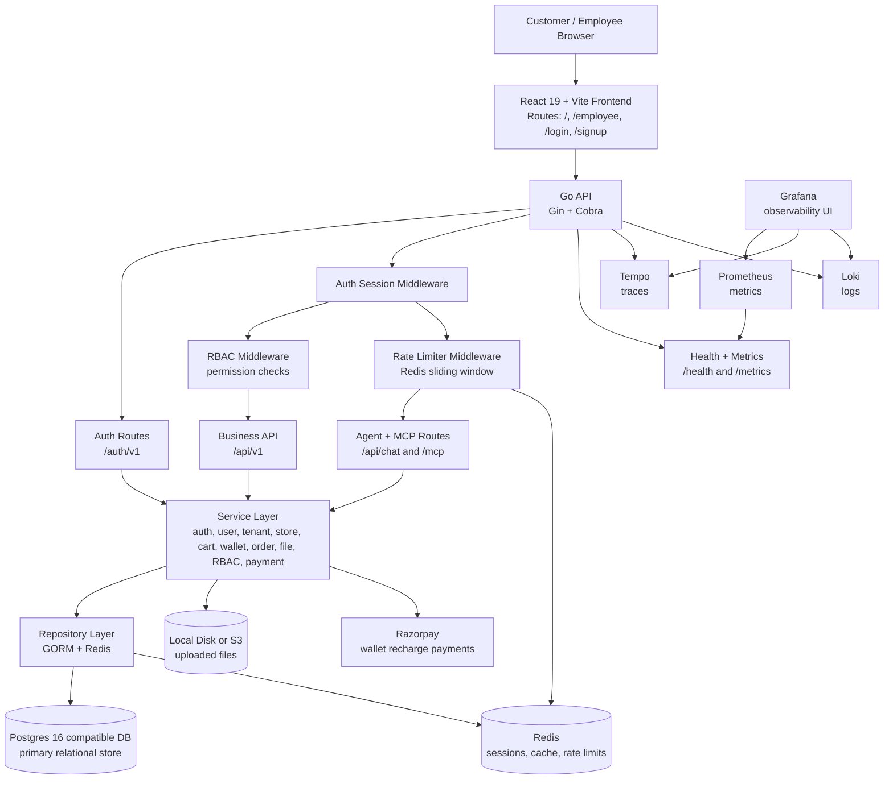

# Grubzo

Grubzo is a cafeteria and canteen ordering platform with a Go API, React frontend, role-based employee console, customer ordering flow, wallet recharge support, file storage, and an AI/MCP chat surface.

## What It Does

- Customer authentication with email/password and OAuth providers.
- Customer menu browsing, cart management, order placement, order history, and wallet recharge.
- Employee console for dashboard, orders, menu items, employees, tenant locations, and access control.
- Tenant, tenant-location, user, role, permission, item, cart, wallet, order, file, and chat persistence.
- RBAC middleware protects employee and business operations by role permission.
- Redis-backed rate limiting protects Agent, chat, and MCP traffic.
- Local or S3-compatible file storage.
- Redis-backed sessions/rate limiting when configured.
- OpenTelemetry tracing, Prometheus metrics, Loki logging, Tempo traces, and Grafana dashboards.
- MCP endpoints and chat sessions backed by application services.

## Architecture



## Tech Stack

- Backend: Go `1.25.0`, Gin, Cobra, GORM, Zap, OpenTelemetry.
- Frontend: Node `22`, npm, React `19`, Vite, TypeScript, Redux Toolkit, Radix UI, Joy UI, lucide-react.
- Data: Postgres-compatible database and Redis.
- Observability: Prometheus, Grafana, Loki, Tempo.
- Payments: Razorpay.
- Storage: local filesystem or S3-compatible storage.

## Repository Layout

```text
cmd/                    CLI commands and runtime wiring
  api/                  application entrypoint
  config.go             config initialization bridge
  serve_cmd.go          API server command
  migrate_cmd.go        database migration command
  database.go           Postgres/GORM connection setup
  redis.go              Redis client setup
  storage.go            local/S3 storage selection
  tracer.go             OpenTelemetry setup

internal/config/        configuration schema and loader
internal/migration/     database migrations
internal/models/        DTOs, entities, and query models
internal/repository/    database/cache repository layer
internal/router/        Gin routes, middleware, sessions, auth, MCP
internal/services/      application business services
internal/utils/         shared utilities, storage, logging helpers

frontend/               React/Vite client application
monitoring/             Loki, Prometheus, and Tempo config
data/                   local Docker bind-mount data
tmp/                    development logs and local file storage
```

## Prerequisites

- Go `1.25.0`
- Node `22`
- npm
- Docker with Docker Compose plugin
- Make

The frontend includes `.nvmrc`, so Node can be selected with:

```bash
cd frontend
nvm use
```

## Configuration

Application configuration is represented by [`internal/config/config.go`](internal/config/config.go). Review that file before running the app; it defines the expected settings for:

- app name and API port
- Postgres connection pool settings
- Redis connection settings
- local or S3 storage
- OAuth providers
- Razorpay keys
- MCP and LLM settings
- Loki and Tempo endpoints
- JWT/session/dev-mode/shutdown/pprof behavior

The command layer loads this config before running `serve` or `migrate`, and the rest of the app receives it through dependency wiring in `cmd/`.

## Local Infrastructure

Start the local service stack:

```bash
docker compose up -d
```

Important service ports:

| Service | Host Port | Purpose |
| --- | ---: | --- |
| Postgres-compatible DB | `5432` | primary SQL database |
| pgAdmin | `5433` | database UI |
| Redis | `5434` | cache/session/rate-limit store |
| Grafana | `5435` | observability UI |
| Tempo | `4318`, `3100` | OTLP traces / Tempo API |
| Loki | `3200` | log ingestion/query API |
| Prometheus | `3300` | metrics scraping UI |

Stop the stack:

```bash
docker compose down
```

## Backend

Install dependencies:

```bash
go mod download
```

Run migrations:

```bash
go run cmd/api/main.go migrate
```

Run the API:

```bash
go run cmd/api/main.go serve
```

Build the binary:

```bash
make build
./grubzo serve
```

Create the seed tenant while serving:

```bash
go run cmd/api/main.go serve --CreateTenant
```

Reset and rerun migrations:

```bash
go run cmd/api/main.go migrate --reset
```

## Frontend

Install dependencies:

```bash
cd frontend
npm ci
```

Run the Vite dev server:

```bash
npm run dev
```

Build the frontend:

```bash
npm run build
```

## Development Workflow

Run Docker services, frontend, and the Go API watcher:

```bash
make watch
```

Useful Make targets:

| Target | Description |
| --- | --- |
| `make docker-up` | start Docker Compose services |
| `make docker-down` | stop Docker Compose services |
| `make run-react` | start Vite in the background and write logs to `tmp/frontend.log` |
| `make run` | start frontend and run the Go API |
| `make migrate` | run database migrations |
| `make build` | build the `grubzo` binary |
| `make watch` | start Docker, frontend, and Air hot reload |
| `make lint-go-fmt` | format Go files |
| `make lint-js` | run frontend Prettier check |

## API Surface

Core endpoints:

| Path | Purpose |
| --- | --- |
| `GET /health` | health check |
| `GET /metrics` | Prometheus metrics |
| `/auth/v1/*` | login, logout, current user, location selection, OAuth |
| `/api/v1/user/*` | user signup, profile reads/updates |
| `/api/v1/tenant/*` | tenant management |
| `/api/v1/location/*` | tenant location management |
| `/api/v1/employee/*` | employee management |
| `/api/v1/rbac/*` | roles and permission grid |
| `/api/v1/item/*` | menu item management and customer menu |
| `/api/v1/cart/*` | cart reads, item quantity updates, cart clearing |
| `/api/v1/wallet/*` | wallet balance and recharge payment verification |
| `/api/v1/order/*` | customer orders and employee order processing |
| `/api/v1/files/*` | file upload and retrieval |
| `/api/chat*` | authenticated chat sessions |
| `/mcp*` | authenticated MCP JSON-RPC and tool endpoints |

The API also reverse-proxies unmatched routes to the Vite frontend dev server at `localhost:8083`, which keeps browser navigation working during local development.

## Data And Runtime Notes

- Database schema migration runs through `internal/migration`.
- `repository.NewRepository(..., doMigration=true)` applies migrations automatically during normal server startup.
- Session storage can be memory or Redis depending on the config schema in `internal/config/config.go`.
- File uploads go through the file service and storage abstraction, then land in local storage or S3 depending on configuration.
- Production-style logs are sent through the Loki writer when dev mode is disabled.
- Traces are exported to Tempo using OTLP over HTTP.
- Metrics are exposed at `/metrics` for Prometheus.

## Frontend Areas

- Customer route `/`: menu, cart, orders, wallet.
- Employee route `/employee`: dashboard, orders, items, employees, locations, access control.
- Public routes: `/login`, `/signup`.
- Auth state is managed by `AuthProvider` plus Redux service slices under `frontend/src/services`.

## Troubleshooting

If Air prints `not found` for the built binary, rebuild directly:

```bash
make build
./grubzo serve
```

If the frontend cannot reach the API, make sure both the Go API and the Vite server are running. `make run` starts the frontend first and then runs the backend.
